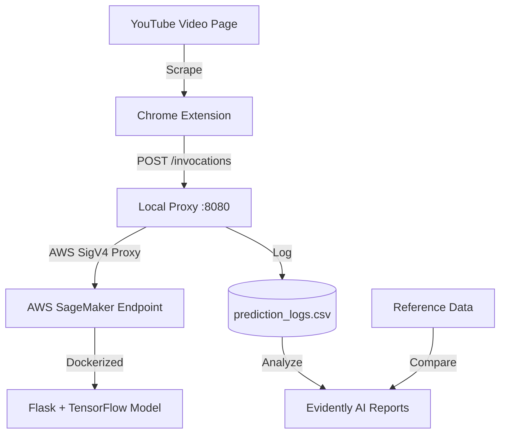

# 🎥 YouTube Sentiment AI & Monitoring System

[](https://aws.amazon.com/sagemaker/)
[](https://www.tensorflow.org/)
[](https://www.evidentlyai.com/)
[](https://www.python.org/)

A professional, end-to-end sentiment analysis solution featuring a **Bi-LSTM Deep Learning model** deployed on **AWS SageMaker**. Analyze YouTube comments in real-time with a custom **Chrome Extension** and monitor model health using **Evidently AI**.

---

## 🌟 Key Features

*   **⚡ Real-Time Inference**: Scrape and analyze YouTube comments directly in your browser.
*   **🧠 Bidirectional LSTM**: Advanced NLP model for 7-class emotion classification (Joy, Sadness, Anger, Fear, Surprise, Disgust, Neutral).
*   **☁️ Cloud Native**: Fully automated deployment to AWS SageMaker via Docker and GitHub Actions.
*   **🛡️ Secure Proxy**: Local bridge for AWS Signature V4 authentication, keeping your IAM keys secret.
*   **📊 Insightful Visuals**: Dynamic Pie Charts in the extension and detailed Drift Reports for monitoring.
*   **📈 Continuous Monitoring**: Detect **Data Drift** and **Target Drift** with automated Evidently AI reports.

---

## 🏗️ System Architecture



---

## 🚀 Getting Started

### Prerequisites
- **Python 3.13+** (using `uv` for package management)
- **AWS CLI** configured (`aws configure`)
- **Docker** (for cloud deployment)

### 1. Installation
Clone the repository and install the production environment:
```powershell
uv sync
```

### 2. Run the Local Proxy
The proxy handles communication between the browser and AWS securely:
```powershell
uv run python sagemaker_proxy.py
```

### 3. Install the Chrome Extension
1. Go to `chrome://extensions/` in Chrome.
2. Enable **Developer Mode**.
3. Click **Load Unpacked** and select the `ChromeExtension/` folder.

---

## ☁️ Deployment (CI/CD)

The project includes a **GitHub Actions** workflow for automated deployment.
- **Push-to-Deploy**: Every push to `main` that modifies the model or Dockerfile triggers a SageMaker redeploy.
- **Manual Deployment**:
  ```powershell
  uv run python deploy_sagemaker.py
  ```

---

## 📊 Monitoring & Model Health

We use **Evidently AI** to ensure our model doesn't become outdated as YouTube slang evolves.

1.  **Collect Data**: The local proxy automatically saves all analysis results to `prediction_logs.csv`.
2.  **Generate Report**:
    ```powershell
    uv run python monitor_model.py
    ```
3.  **Analyze**: Open `monitoring_report.html` to visualize if your live data has "drifted" from your original training data.

---

## 📁 Repository Structure

| File | Description |
| :--- | :--- |
| **`BiLSTM.py`** | Model architecture and training logic. |
| **`DataSetup.py`** | Data cleaning and 7-class mapping. |
| **`deploy_sagemaker.py`** | AWS Automation script (ECR + SageMaker). |
| **`inference.py`** | The API server running inside the cloud container. |
| **`sagemaker_proxy.py`** | The security bridge for the Chrome Extension. |
| **`monitor_model.py`** | Drift detection and report generation. |
| **`ChromeExtension/`** | Browser code (Scraper, UI, Charting). |

---

## 🛠️ Tech Stack
- **Backend**: TensorFlow, Keras, Flask, Boto3
- **Cloud**: AWS ECR, AWS SageMaker
- **Frontend**: Javascript, Chart.js, CSS Glassmorphism
- **Monitoring**: Evidently AI
- **DevOps**: GitHub Actions, Docker, uv

---
**Maintained by**: MohithTP | **Status**: Production Ready 🚀
